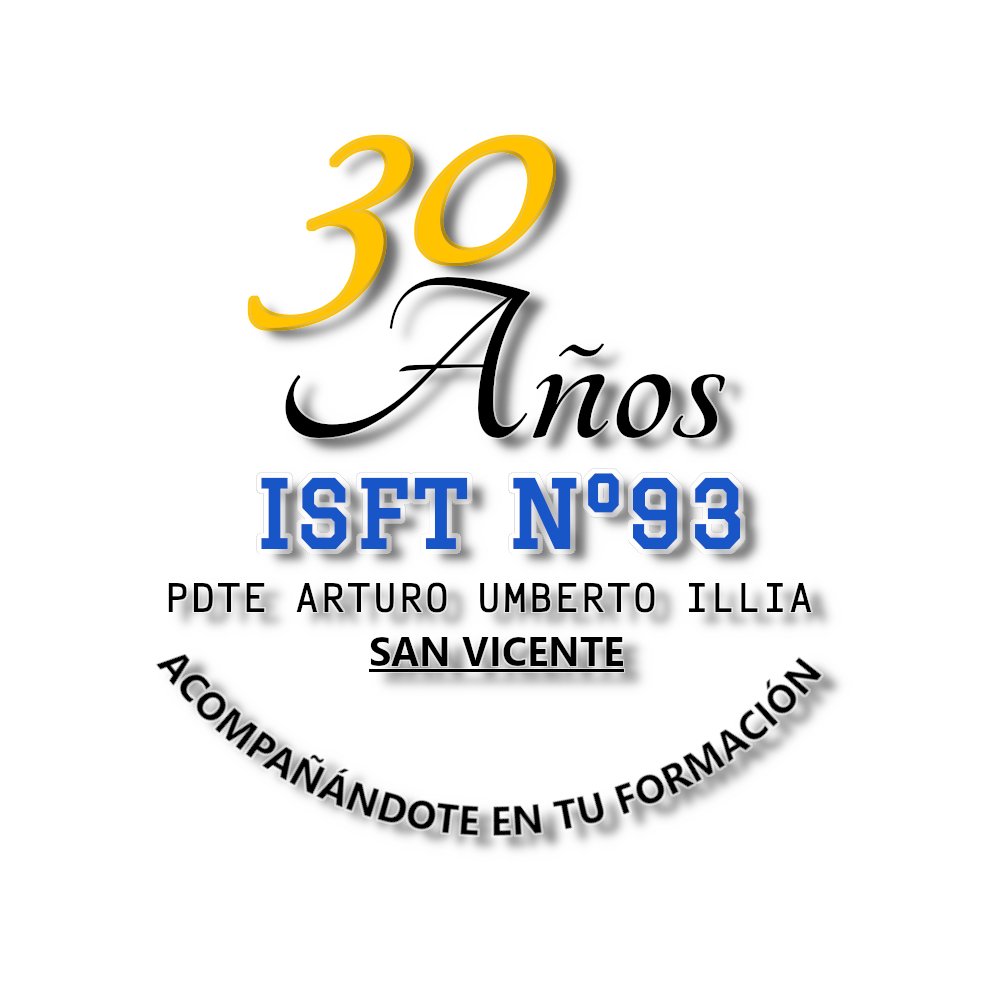

# Guia 9

## Instituto Superior De Formación Técnica N.º 93

### Pdte. Arturo Umberto Illia

---

## Tecnicatura Superior En Análisis, Desarrollo Y Programación De Aplicaciones

**ESPACIO CURRICULAR**: Seminario de programación

**CURSO**: 2 Año, División B

**CICLO LECTIVO**: 2025

**PROFESOR**: Pacífico Ezequiel

###### ALUMNO: Nicolás Sandoval

---

